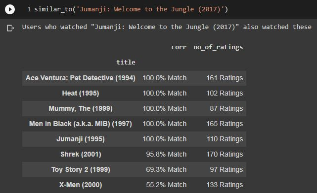

**<h1>
Movie Recommender System (Content-Based)
</h1>**

**<h2>Problem Statement: </h2>**

To recommend similar movies in the data based on user selected movie from dataset.

&nbsp; 
**Data used**: [ml-latest-small.zip](https://grouplens.org/datasets/movielens/latest/) [100836 Records]

&nbsp;

**<h2>Project Planning :</h2>** 

### **Data Understanding**
- **Imports -** 
  - Contains all the imports necessary for reading data, visualizations.
  - Extracting files from Movielens Zip file
- **Exploring Data -**
  - Understand the nature of the data *.info()*
  - Getting unique users, titles, and genres.
  - Obtaining insights on the Number of Ratings, Average Rating, and their relation via various graphs

### **Building a System**
- Creating a pivot table
- Making suggestions using a single title. 

### **Recommendation System**
- Creating a function '*similar_to*' for fetching likable titles to user-specified movies. 
- Keyword search privilege for a user to select a specific movie title from the dataset.

- Suggesting movies along with match percentage and number of ratings similar to the user-selected title. 

