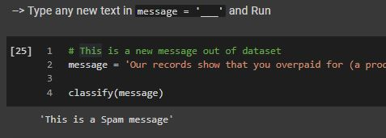

**<h1>
SMS Spam Classifier 
</h1>**

**<h2>Problem Statement: </h2>** 
>  To classify a new text message provided by a user is **spam** or **not spam**.

 

**Data Link**: [UCI SMS Spam Collection Data Set](https://archive.ics.uci.edu/ml/datasets/SMS+Spam+Collection/) [5572 Documents]
 

***Keywords:*** *make_pipeline, CountVectorizer, TfidfTransformer, LogisticRegression, MultinomialNB, stop_words*

---

**<h2>Project Planning :</h2>** 

### **1. Gathering Data**
- **Imports -** 
  - Contains all the imports necessary for reading data, visualizations and model buiding and evaluating.
- Extracting zip files from downloaded UCI dataset.

### **2. Exploring Data**
- Understand the nature of the data .info() .describe()
- Understand the Distribution of target labels.
- Obtaining insights on the new column 'length', spam and ham messages, and their relation via graphs

### **3. Model Building**
- Data is split in to *train* and *test* messages .
- Text Messages are first converted in to Bag-of-words representation using *CountVectorizer* and *TfidfTransformer*, then to a Model.
- **Pipeline -** 
  - Deploying a Pileline, constructed using below three steps.
   
  
  1. **Count Vectorizer -**
    - Remove common English words using *stop_words*.
    - **Tokenization**: Splits each document into the words that appear in it on whitespace and punctuation.
    - **Vocabulary building**: Collect a vocabulary of all words that appear in any of the documents, and numbers them.
     
    
  2. **Tf-idf Transformer -** 
    - Takes in the sparse matrix output produced by Count Vectorizer and transforms it by giving high weight to any term that appears often in a particular document, but not in many documents in the corpus.
     
    
  3. **Model -**
    - *Logistic Regression* and *Multinomial Naive Bayes* Classifiers to classify messages (tf-idf sparse matrix) in to Spam or Ham 

- **GridSearchCV -**
  - Deploying a grid search using Pipeline, Parameters to adjust, with Cross-Validation of 5 folds.
  - Fitting the created grid with train data and obtaining the Best cross-validation score and Best Parameters

- Exploring created Vocabulary, Stop Words, TFIDF Vocabulary

### **4. Predictions and Evaluation**
  - Predictions on test text data.
  - Evaluation of model with classification report and confusion matrix.

### **5. New SMS Classifier Prediction for User** 
  - Building a complete model with best parameters and best estimator obtained from GridSearchCV on whole dataset (X and y) without splitting.
  - Developing a function '*classify*', to classify any user provided message in to spam or not spam.
  - Previlage for user to input any text message and Check model predictions on SMS.
  &nbsp;
  
  
---

Solution by     : **Aditya Karanth**.

GitHub Profile  : https://github.com/Aditya-Karanth

Kaggle Profile  : https://www.kaggle.com/adityakaranth

LinkedIn Profile: https://www.linkedin.com/in/u-aditya-karanth-2206/
